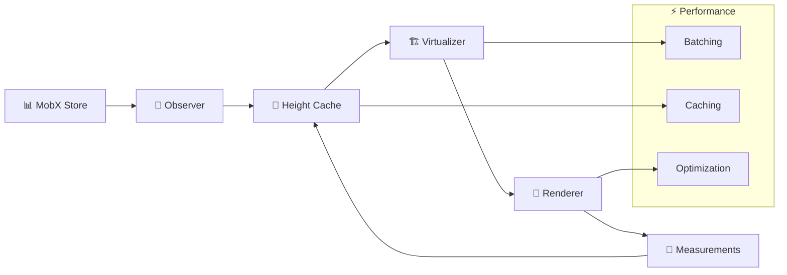

# 🚀 TypeScript Fullstack Pet Project

<div align="center">

**Modern real-time social platform with intelligent feeds, role system and advanced architecture**


</div>

---

## 🎯 About the project

**Pet project exploring modern JS fullstack technologies**

- **Posts and comments** with unlimited nesting
- **Subscription system** - follow users and get personalized feeds  
- **Global search** across posts, comments and users
- **Three-tier role system** with admin panel and visual badges
- **Real-time updates** for all content
- **Smart feeds** - All/Following/User with intelligent caching
- **Optimistic UI** - instant likes and reactions
- **Security** - JWT auth + CAPTCHA protection + session management
- **Queue monitoring** - performance control and automatic alerts
- **Stress testing** - handles extreme loads with queue + batching architecture

---

## 🏗️ Architecture

### Backend: Gateway → Queue → Consumer

**NestJS backend with three-tier message processing:** Gateway accepts requests and gives instant response → RabbitMQ queues ensure guaranteed delivery and horizontal scaling → Consumers process data and sync all clients via `server.emit()`. This provides UX without delays while maintaining data consistency.

**Security includes multi-level WebSocket protection:** rate limiting (20 req/min for users, 200 for admins), attack pattern detection (rapid fire, endpoint hammering), and JWT validation with role checking. WebSocket namespaces organize features (`/users`, `/posts`, `/comments`, `/search`) with room-based personalization for targeted updates.

**Smart queue management** uses TTL messages, lazy queues, message priorities, and real-time monitoring with automatic alerts when limits are exceeded. Built-in TestService generates massive test data with special privileges for stress testing.

### Frontend: MobX + Virtual Scrolling

**React 19 with MobX state management** using strict mode and atomic transactions via `runInAction`. Observer components automatically re-render only affected parts, ensuring predictable updates. Singleton registry pattern with dependency injection provides clean architecture and eliminates circular dependencies.

**Advanced batching system** adapts processing strategies based on load (idle/low/medium/high/extreme) with dynamic batch sizes from 5 to 1000 elements. Virtual scrolling with TanStack handles thousands of posts efficiently using height estimation, DOM measurements, and intelligent caching.

**Built-in testing panel** allows mass data generation, stress testing UI, virtual scrolling tests, and admin tools. Optimistic UI provides instant feedback with background sync and auto-rollback on errors.

---

## ⚡ Key Features

- **🎯 Reactive Architecture** - Atomic transactions ensure consistency with automatic rollback
- **🔄 Smart Feed Management** - Buffer new posts + manual mode + cross-tab persistence  
- **🚀 Hybrid Processing** - Instant user response + guaranteed background processing
- **⚡ Optimistic UI** - Instant updates with background sync and auto-rollback
- **📊 Proactive Monitoring** - Real-time queue monitoring with automatic alerts
- **🔐 Account Security** - Single-device sessions with breach notifications
- **🧪 Production Testing** - Built-in load testing simulating thousands of users

---

## 🎨 Reactive Rendering Flow

<details>
<summary><strong>Virtual Scrolling Architecture</strong></summary>



</details>

---

## 🛠️ Tech Stack

| Layer | Technology | Purpose |
|-------|------------|---------|
| **Frontend** | React 19 + TypeScript | Type-safe reactive UI |
| **State** | MobX 6 | Observable state management |
| **Backend** | NestJS + TypeScript | Scalable server architecture |
| **Database** | PostgreSQL + TypeORM | Relational data with migrations |
| **Queue** | RabbitMQ | Reliable async processing |
| **Real-time** | Socket.IO | WebSocket communication |
| **Search** | Elasticsearch | Full-text search engine |
| **Auth** | JWT + Guards | Secure authentication |

---

## 🚀 Quick Start

### Prerequisites
- Docker & Docker Compose
- Node.js 20+
- Bash

### 🎯 Run Development

````bash
git clone https://github.com/lsthisloss/spa-comments.git
cd spa-comments
./run.sh
# Select option 1 for development mode
````

### 🌐 Access Points

- **Frontend:** http://localhost:3000
- **Backend:** http://localhost:3001  
- **Queue Status:** http://localhost:3001/api/monitoring/queue-status
- **Health Check:** http://localhost:3001/api/monitoring/health

### 🎮 First Steps

1. Create superadmin account
2. Generate test data via Settings → Admin Panel
3. Run stress tests (superadmin only)

**⚠️ Note:** Option 6 in run script deletes ALL Docker containers/images

---

<details>
<summary>🎨 Demo </summary>
---


</details>

---
**Timeline:** 3 weeks   
**What I learned:** Scalable architecture, real-time systems, performance optimization, security patterns      
Developed w/ ❤️ by **sk8**
Coda doc: https://coda.io/@oleh-khad/jeez
