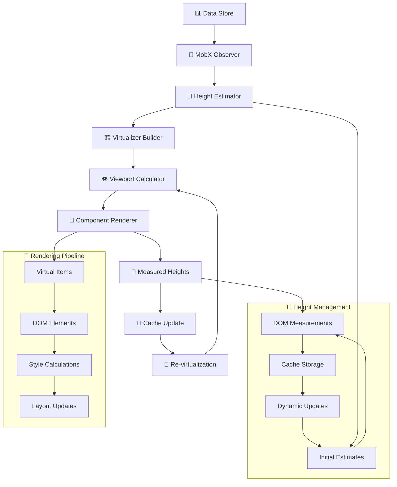
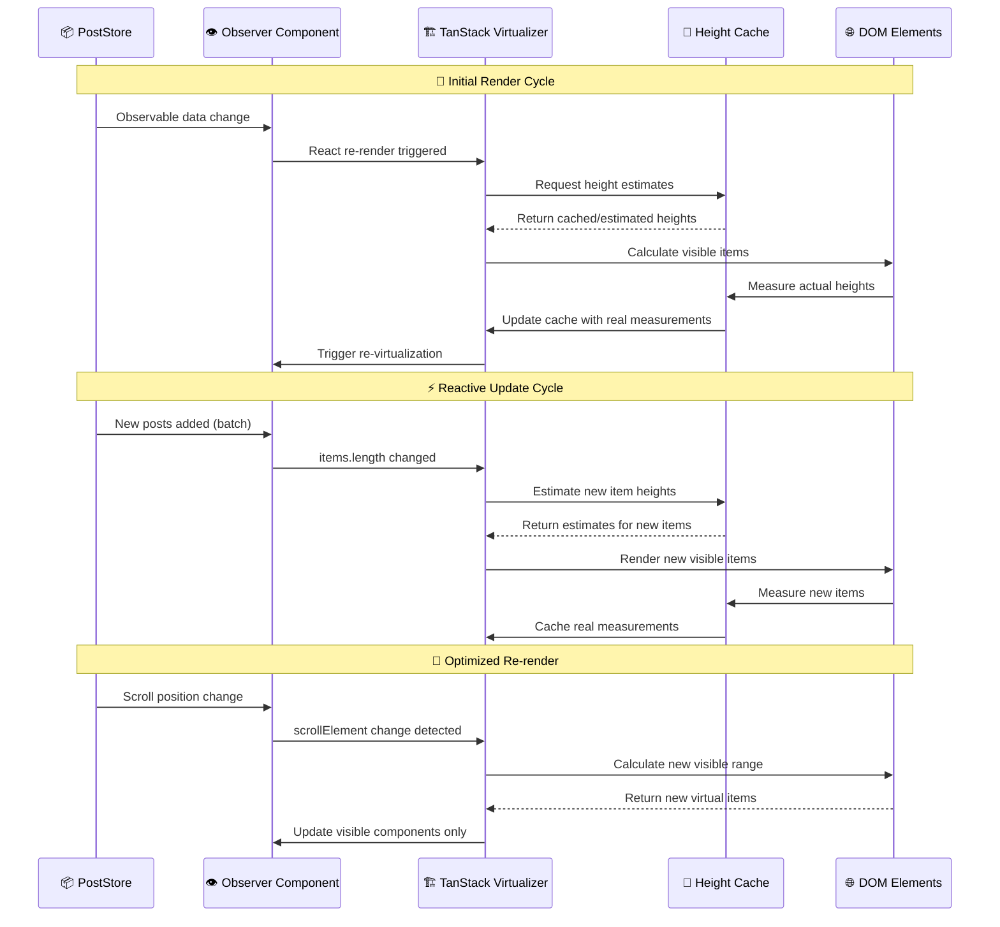
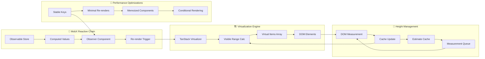
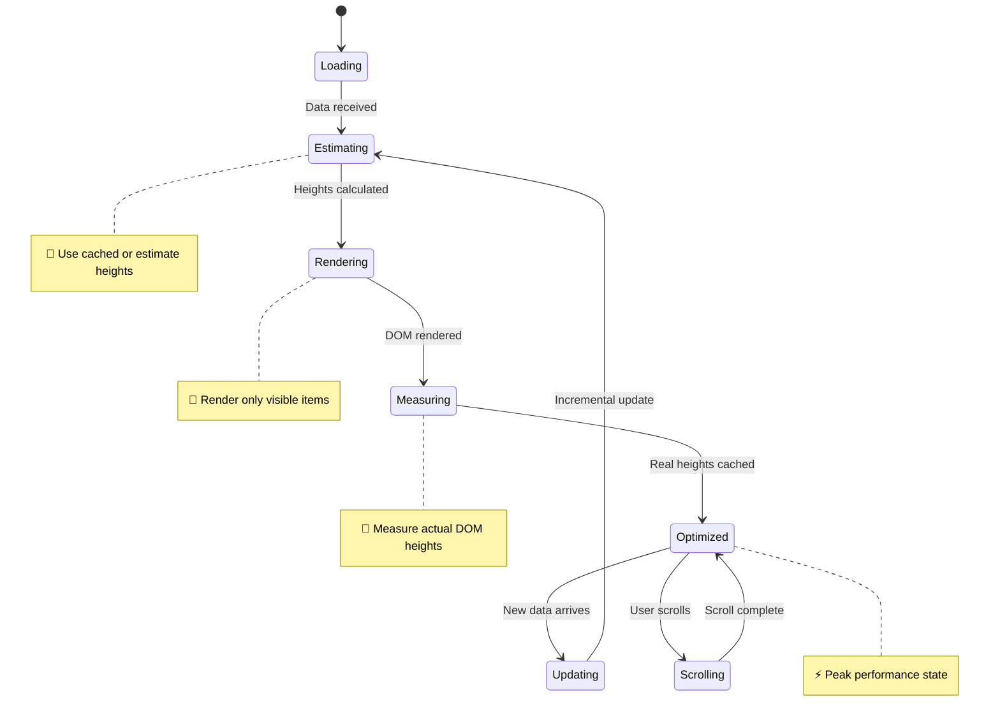

# 🚀 Jeez! - TypeScript Fullstack Social Platform

<div align="center">

**Современная социальная платформа в реальном времени с интеллектуальными лентами, системой ролей и продвинутой архитектурой**


</div>

---

## 🌟 О проекте

**Cоциальная платформа**

- 📱 **Посты и комментарии** с неограниченной вложенностью
- 👥 **Система подписок** - следи за интересными пользователями  
- 🔍 **Глобальный поиск** по постам, комментариям и пользователям
- 👑 **Трёхуровневая система ролей** с админ-панелью и визуальными бейджами
- ⚡ **Real-time** обновления всего контента
- 📊 **Интеллектуальные ленты** - All/Following/User с умным кэшированием
- 🎯 **Optimistic UI** - мгновенные лайки и реакции
- 🔐 **Безопасность** - JWT авторизация + CAPTCHA защита + защита сессий
- 📈 **Мониторинг очередей** - контроль производительности и автоматические алерты
- 🧪 **Stress Testing** - выдерживает экстремальные нагрузки благодаря продуманной архитектуре

---

## ⏱️ Timeline разработки

<details>
<summary><strong>📊 Хронология проекта</strong></summary>

**Timeline:** ~3 weeks alpha

- **Дни 1-3:** Research архитектурных решений
- **Дни 4-7:** Базовая архитектура backend + WebSocket infrastructure + Queue system
- **Дни 8-12:** Frontend архитектура, MobX stores, компонентная система, внедрение TanStack
- **Дни 12-14:** Advanced features (roles, search, monitoring, stress testing)
- **Дни 14-21:** Polish, optimization

**Breakdown по технологиям:**
- 🏗️ **Backend (NestJS):** ~8 дней
- ⚛️ **Frontend (React):** ~11 дней  
- 🔧 **DevOps & Testing:** ~2 дня

</details>

---

## 🏗️ Архитектура

### Backend: Gateway → Queue → Consumer Pattern

<details>
<summary><strong>🔧 Трёхуровневая обработка</strong></summary>

**Gateway** - принимает запросы, мгновенный ответ клиенту  
**Queue** - гарантированная доставка, горизонтальное масштабирование  
**Consumer** - обработка + синхронизация всех клиентов через `server.emit()`

**Результат:** UX без задержек + консистентность данных

</details>

<details>
<summary><strong>🛡️ Security & Rate Limiting</strong></summary>

**Многоуровневая защита WebSocket соединений:**

### WsThrottlerGuard
- **Rate limiting** для обычных пользователей: 20 req/min
- **Релаксированные лимиты** для админов и тестовых клиентов: 200 req/min
- **Автоочистка** старых записей каждые 5 минут
- **Гибкие ограничения** по IP + clientId для тестовых сценариев

### RequestPatternGuard  
- **Обнаружение атак:** rapid fire (20+ req/5sec), endpoint hammering (15+ одинаковых запросов)
- **Подозрительная активность:** множественные IP адреса, аномальные паттерны
- **Автоматическое блокирование** подозрительных клиентов

### WsJwtGuard
- **JWT валидация** для всех защищенных endpoints
- **Проверка ролей** и установка контекста пользователя
- **Поддержка тестового режима** с дополнительными привилегиями

```typescript
// Пример конфигурации guards
@UseGuards(WsThrottlerGuard, RequestPatternGuard, WsJwtGuard)
@SubscribeMessage('addPost')
async handleAddPost(@MessageBody() data: CreatePostDto) {
  // Защищенный endpoint с многоуровневой проверкой
}
```

</details>

<details>
<summary><strong>🛡️ WebSocket Namespaces & Rooms</strong></summary>

**Структурированные пространства имен:**
- `/users` - Управление пользователями, аутентификация, сессии
- `/posts` - Операции с постами, управление лентами, персонализация  
- `/comments` - Комментарии, вложенные ответы, real-time дискуссии
- `/search` - Полнотекстовый поиск с живыми результатами

**JWT Guard** проверяет токены при подключении, сохраняет данные в `client.data`

**Room-based архитектура для персонализации:**

```typescript
// Автоматическое подключение к персональной комнате пользователя
postsSocket.emit('joinRoom', `user:${userId}`);

// Отправка уведомлений только подписчикам
server.to(`user:${authorId}`).emit('newFollowingPost', post);

// Глобальные события для всех клиентов
server.emit('newPost', post);
```

**Связь Store → Feed → Room → VirtualList:**

1. **PostStore** управляет данными и WebSocket событиями
2. **Feed Context** определяет активную ленту (`feed-default`, `following-default`)
3. **Room Subscription** фильтрует события по пользователю/подпискам
4. **VirtualList** реагирует только на события своей ленты через `feedContextId`

**Умная фильтрация событий:**
```typescript
// VirtualList получает события только для своей ленты
const currentFeedType = feedContextId?.split('-')[0]; // 'following-default' - 'following'

if (feedType !== currentFeedType) {
  return; // Игнорируем события других лент
}
```

**Преимущества архитектуры:**
- ✅ **Персонализированные обновления** - пользователь получает только релевантный контент
- ✅ **Эффективное использование ресурсов** - минимум трафика и обработки
- ✅ **Изолированные ленты** - каждый VirtualList обрабатывает только свои события
- ✅ **Масштабируемость** - room-based подход легко горизонтально масштабируется

</details>

<details>
<summary><strong>📊 Queue Management & Monitoring</strong></summary>

**Умное управление очередями RabbitMQ:**
- **TTL сообщений**: автоудаление через 5 минут для предотвращения переполнения
- **Ограничения очередей**: максимум 5000 сообщений или 50MB на очередь
- **Lazy queues**: экономия памяти с записью на диск при необходимости
- **Приоритеты сообщений**: комментарии обрабатываются быстрее постов

**Real-time мониторинг:**
- **Автоматические алерты** при превышении 1000/3000 сообщений
- **Memory watermark**: ограничение использования памяти на 60%
- **Queue statistics API** для мониторинга состояния системы
- **Emergency cleanup** при критической нагрузке

**API endpoints для мониторинга:**
```bash
# Проверка статуса очередей
curl http://localhost:3001/api/monitoring/queue-status

# Здоровье системы
curl http://localhost:3001/api/monitoring/health
```

</details>

<details>
<summary><strong>🧪 Advanced Testing Infrastructure</strong></summary>

**TestService на backend:**
- **Генерация тестовых данных** - посты, комментарии, пользователи
- **Stress testing endpoints** для проверки производительности  
- **Управление тестовыми пользователями** с особыми привилегиями
- **Интеграция с guards** - тестовые клиенты получают повышенные лимиты

**Возможности TestService:**
```typescript
// Массовая генерация контента
@SubscribeMessage('generateTestPosts')
async generateTestPosts(@MessageBody() { count, userId }: TestDataDto) {
  // Создает множество тестовых постов для нагрузочного тестирования
}

// Создание тестовых пользователей
@SubscribeMessage('createTestUser') 
async createTestUser(@MessageBody() userData: CreateTestUserDto) {
  // Создает пользователя с тестовыми привилегиями
}
```

**Особенности тестовых клиентов:**
- Обход CAPTCHA проверки
- Повышенные rate limits (200 vs 20 req/min)
- Специальные метки для обработки в guards
- Генерация больших объемов данных без блокировок

</details>

### Frontend: Реактивность + Производительность

<details>
<summary><strong>⚡ MobX State Management</strong></summary>

- **Strict Mode** с атомарными транзакциями через `runInAction`
- **Observer components** - автоматический ре-рендер только затронутых компонентов
- **Predictable updates** - все изменения в одной транзакции

</details>

<details>
<summary><strong>🏭 Dependency Injection & Singleton Registry</strong></summary>

- **Singleton Registry Pattern** - централизованная регистрация сторов через `createStores()`
- **Dependency Injection** - инъекция зависимостей через конструкторы вместо прямых импортов
- **React Hooks API** - типобезопасные хуки `useUserStore()`, `usePostStore()` и т.д.

**Решаемые проблемы:**
- ✅ Устранение циклических зависимостей между сторами
- ✅ Повышение тестируемости с возможностью подмены зависимостей
- ✅ Более чистая архитектура с явным описанием зависимостей
- ✅ Лучшая поддержка Tree Shaking и оптимизация сборки

**Реализация:**

```typescript
// Создание сторов с правильными зависимостями
export function createStores(): Stores {
  const authStore = new AuthStore();
  // Разрыв циклических зависимостей через заглушки
  const tempUserStore = {} as UserStore;
  const socketStore = new SocketStore(authStore, tempUserStore);
  
  // Инъекция реальных зависимостей
  const userStore = new UserStore(authStore, socketStore);
  Object.assign(tempUserStore, userStore);
  
  return { authStore, socketStore, userStore, /* ... */ };
}

// Хуки для доступа к сторам в компонентах
export function useUserStore() {
  const stores = useContext(StoresContext);
  return stores.userStore;
}
```
</details>

<details>
<summary><strong>🎯 Virtual Scrolling</strong></summary>

Универсальный хук `useVirtualItems` для постов и комментариев:
- **Adaptive buffering** по скорости скролла
- **Memory efficiency** для больших списков  
- **Type-safe API** для любого контента

</details>

<details>
<summary><strong>🚀 Advanced Batching System</strong></summary>

**Интеллектуальный BatchingService для Frontend:**

### Адаптивные стратегии обработки
- **Fixed batching** - постоянный размер батчей для стабильной нагрузки
- **Adaptive batching** - динамическое масштабирование под текущую активность
- **Load-aware processing** - автоматическое определение уровня нагрузки (idle/low/medium/high/extreme)

### Smart buffering
```typescript
// Конфигурация батчинга
const batchConfig = {
  sizes: {
    adaptive: {
      tiny: 5,     // Для низкой активности  
      medium: 35,  // Для средней нагрузки
      huge: 150,   // Для высокой нагрузки
      massive: 300 // Для экстремальных условий
    }
  },
  timing: {
    idle: 2000,    // Редкие обновления
    medium: 200,   // Умеренная активность  
    extreme: 50    // Максимальная скорость
  }
};
```

### Crash Test Mode
- **Stress testing** с батчами до 1000 элементов
- **Экстремальные тайминги** - обработка каждые 5-10ms
- **Memory management** с принудительной очисткой
- **Статистика производительности** в real-time

**Результат:** система выдерживает тысячи постов без деградации UI

</details>

<details>
<summary><strong>🧪 Frontend Testing Panel</strong></summary>

**Debug Tools в Developer Settings:**

### Test Data Generation
- **Массовое создание постов** - неограничено, с конкурирующими потоками
- **Массовое создание пользователей** - неограничено, с конкурирующими потоками
- **Stress testing UI** с real-time метриками
- **Тестирование Virtual Scrolling** на больших объемах

### Performance Monitoring  (console)
- **Batching statistics** - размеры батчей, тайминги обработки
- **Virtual List metrics** - буферизация и оптимизация прокрутки

### Admin Tools
- **User management** - промоушен в админы
- **Content moderation** - управление постами/комментариями  
- **System statistics** - общая статистика приложения
- **Emergency controls** - аварийная очистка кэшей

```typescript
// Пример интерфейса тестовой панели
const TestPanel = () => {
  const enableHighLoadMode = () => {
    batchingService.enableHighLoadMode();
    // Переключает на aggressive batching для stress testing
  };
  
  const generateTestPosts = (count: number) => {
    socket.emit('generateTestPosts', { count, userId });
    // Создает множество тестовых постов
  };
};
```

</details>

---

## 🔧 Ключевые инновации

### 🎯 Реактивная архитектура с предсказуемым состоянием
**Проблема:** Хаотичные обновления состояния приводят к race conditions.  
**Решение:** Атомарные транзакции через `runInAction` обеспечивают консистентность и автоматический откат при ошибках.

### 🔄 Интеллектуальное управление лентами
**Проблема:** Ленты сбрасывают состояние при навигации.  
**Инновация:** Буферизация новых постов + manual mode + межвкладочная персистентность. Пользователь не теряет контекст.

### 🚀 Гибридная Gateway-Queue-Consumer архитектура  
**Проблема:** REST API не обеспечивает real-time консистентность.  
**Решение:** Мгновенный ответ пользователю + гарантированная обработка в фоне + синхронизация всех клиентов.

### ⚡ Optimistic UI с автосинхронизацией
**Инновация:** Двухфазная обработка - мгновенное обновление UI + фоновая синхронизация с автооткатом при ошибках.

### 🧭 Контекстная навигация
**Особенность:** Slug-based маршрутизация + сохранение позиции скролла + предзагрузка контекста.

### 📊 Проактивный мониторинг системы
**Инновация:** Real-time мониторинг очередей с TTL, автоматическими алертами и emergency cleanup для предотвращения перегрузок.

### 🔐 Безопасность учетных записей
**Инновация:** Защита от множественного входа в аккаунт - один пользователь может быть авторизован только на одном устройстве, с уведомлением при обнаружении другой сессии.

### 🧪 Production-Ready Stress Testing
**Уникальность:** Встроенная система нагрузочного тестирования, способная симулировать тысячи пользователей и проверять производительность в реальном времени.

---

## 📱 Продвинутые возможности

<details>
<summary><strong>📰 Intelligent Feed System</strong></summary>

**Трёхуровневая система лент:**
- **All Feed** - Глобальная лента всех постов
- **Following Feed** - Персонализированная лента подписок  
- **User Profiles** - Персональные страницы пользователей

**Умное поведение:**
- ✅ Состояние сохраняется при переходах между лентами
- ✅ Буферизация новых постов без потери позиции
- ✅ Manual mode - контролируемые обновления
- ✅ Межвкладочная синхронизация

</details>

<details>
<summary><strong>👥 Social Features</strong></summary>

- **Подписки на пользователей** с персонализированной лентой
- **Лайки и реакции** с optimistic updates  
- **Профили пользователей** с аватарами и статистикой

</details>

<details>
<summary><strong>🗨️ Advanced Comments System</strong></summary>

- **Неограниченная вложенность** с производительной оптимизацией
- **Ленивая загрузка веток** + сворачивание с сохранением состояния  
- **Real-time обновления** на любом уровне вложенности
- **Threaded discussions** с навигацией по веткам

</details>

<details>
<summary><strong>👑 Admin Panel & Role Management</strong></summary>

**Трёхуровневая система ролей:**
- `user` - Базовые права (создание постов/комментариев)
- `admin` - Модерация + Debug Tools + Привилегия бейджика над постом
- `superadmin` - Полный контроль + управление админами

**SuperAdmin возможности:**
- 🛡️ Промоушен пользователей в админы
- 📊 Статистика пользователей 
- 🔧 Advanced Debug Tools с генерацией тестовых данных

**Привилегии администраторов:**
- 👑 Визуальные бейджи ролей в профилях и постах
- ✅ Отправка контента без CAPTCHA-проверки
- 🛠️ Расширенные возможности модерации
- 📊 Доступ к системной статистике и debug-инструментам

**Безопасность:**
- JWT-based авторизация с проверкой ролей
- Backend валидация всех админских операций
- Frontend/Backend синхронизация ролей в реальном времени
- 🔐 Защита от множественного входа в учетную запись

**UI интеграция:**
- 🛠️ Admin Panel в Developer Settings

</details>

<details>
<summary><strong>🔍 Elasticsearch Search</strong></summary>

- Мультиентити поиск (посты/комментарии/пользователи) от 3 символов
- Real-time подсказки с debounce + табы результатов

</details>

<details>
<summary><strong>📤 Media Support</strong></summary>

- Image upload с автооптимизацией + файловые вложения
- Drag & drop с визуальной обратной связью + CAPTCHA защита

</details>

<details>
<summary><strong>🔐 Session Security</strong></summary>

**Защита от множественного входа:**
- Отслеживание активных сессий пользователей на сервере
- Автоматическое отключение предыдущей сессии при новом входе
- Уведомление пользователя о принудительном выходе с указанием причины
- Безопасная передача JWT-токенов и проверка авторизации

**Преимущества:**
- Защита от несанкционированного доступа к аккаунту
- Предотвращение утечки данных при компрометации токена
- Мгновенное оповещение владельца учетной записи о подозрительной активности

</details>

<details>
<summary><strong>📊 System Monitoring</strong></summary>

**Queue Health Monitoring:**
- **Real-time статистика** очередей сообщений
- **Автоматические алерты** при превышении лимитов (1000+ сообщений = warning, 3000+ = critical)
- **TTL контроль**: автоудаление сообщений старше 5 минут
- **Memory management**: ограничение использования RAM на 60%

**Monitoring API:**
```bash
# Детальная статистика очередей
curl http://localhost:3001/api/monitoring/queue-status

# Общее состояние системы
curl http://localhost:3001/api/monitoring/health
```

**Response примеры:**
```json
// Queue Status
{
  "totalMessages": 1500,
  "queues": {
    "posts": { "messageCount": 800, "unacknowledgedCount": 0 },
    "comments": { "messageCount": 700, "unacknowledgedCount": 0 }
  },
  "status": "warning",
  "timestamp": "2025-06-02T12:00:00Z",
  "memoryUsage": { "rss": 134217728, "heapUsed": 89456432 }
}

// Health Check
{
  "status": "ok",
  "timestamp": "2025-06-02T12:00:00Z",
  "uptime": 3600,
  "memory": { "rss": 134217728, "heapUsed": 89456432 }
}
```

</details>

<details>
<summary><strong>🐛 Debug Tools</strong></summary>

Детальная информация о состоянии лент, виртуального списка, буферов и режимов работы с кнопками для генерации тестовых данных.

</details>

---

## ⚡ Reactive Rendering Architecture

<details>
<summary>🎯 Virtual Scrolling + Dynamic Heights Flow</summary>


</details>

<details>
  
<summary>🔄 MobX Reactivity Flow</summary>


</details>

<details>
<summary>🏗️ Dynamic Height Calculation Pipeline</summary>

```typescript
// 📏 Height estimation with intelligent caching
const stableEstimateSize = useCallback((index: number) => {
  if (index < 0 || index >= items.length) {
    return 128; // Default height
  }

  const item = items[index];
  const itemKey = getItemKey(item);

  // ✅ Phase 1: Check cache first
  if (measuredHeights.current.has(itemKey)) {
    return measuredHeights.current.get(itemKey)!;
  }

  // ✅ Phase 2: Estimate based on content
  const baseHeight = estimateItemHeight(item);
  
  // ✅ Phase 3: Enhanced estimation for complex content
  const hasImage = item.imageUrl || item.fileName;
  let estimatedHeight;

  if (hasImage) {
    const content = typeof item.content === 'string' ? item.content : '';
    const textHeight = Math.max(40, content.length * 0.6);
    const headerHeight = 60;
    const imageHeight = Math.min(240, Math.max(80, 120));
    const footerHeight = 50;
    const padding = 20;

    estimatedHeight = headerHeight + imageHeight + textHeight + footerHeight + padding;
  } else {
    const content = item.content || '';
    if (typeof content === 'string' && content.length > 200) {
      estimatedHeight = Math.max(baseHeight, 180);
    } else {
      estimatedHeight = Math.max(baseHeight, 100);
    }
  }

  // ✅ Phase 4: Round and cache estimate
  estimatedHeight = Math.round(estimatedHeight);
  measuredHeights.current.set(itemKey, estimatedHeight);

  return estimatedHeight;
}, [items, estimateItemHeight, getItemKey]);
```
</details>

<details>
<summary>🎨 Render Optimization Strategy</summary>



<summary>🔄 Reactive State Transitions</summary>



</details>

---

## 🛠️ Technical Debt & Future Improvements

<details>
<summary><strong>📋 Planned Refactoring</strong></summary>

### Store Architecture
- **Разделение монолитных stores** - PostStore и CommentStore требуют рефакторинга
- **Extraction of business logic** в отдельные сервисы
- **Better separation of concerns** между UI и data layers

### Virtual Scrolling Snapshots  
- **State persistence** для Virtual List
- **Scroll position recovery** при навигации между страницами
- **Context-aware buffering** для оптимизации памяти

### Code Organization
- **Service layer abstraction** для упрощения stores
- **Модульная архитектура** с четким разделением ответственности  
- **Enhanced type safety** с более строгими интерфейсами

</details>

<details>
<summary><strong>🎯 Roadmap</strong></summary>

### API & Architecture
- [ ] Микросервисные обёртки для унификации
- [ ] Rate limiting + GraphQL интеграция
- [ ] Advanced caching strategies

### UI/UX  
- [ ] Дизайн-система + тёмная тема
- [ ] Mobile-responsive + accessibility
- [ ] Progressive Web App features

### DevOps & Scaling
- [ ] Service Workers для offline
- [ ] CI/CD пайплайны + комплексное тестирование
- [ ] Kubernetes deployment configs
- [ ] Advanced monitoring & alerting

### Performance
- [ ] Database query optimization
- [ ] CDN integration для media files
- [ ] Advanced Virtual Scrolling с snapshot recovery

</details>

---

## 🔗 Tech Stack

| Layer | Technology | Purpose |
|-------|------------|---------|
| **Frontend** | React 19 + TypeScript | UI с строгой типизацией |
| **State** | MobX 6 | Реактивное состояние |
| **Backend** | NestJS + TypeScript | Масштабируемая архитектура |
| **Database** | PostgreSQL + TypeORM | Реляционные данные |
| **Queue** | RabbitMQ | Надёжная обработка сообщений |
| **Real-time** | Socket.IO | WebSocket коммуникация |
| **Search** | Elasticsearch | Полнотекстовый поиск |
| **Auth** | JWT + Guards | Безопасная аутентификация |
| **Testing** | Custom TestService | Stress testing & data generation |

---

## 🏆 Key Achievements

- **⚡ Performance:** Выдерживает экстремальные нагрузки благодаря queue + batching architecture
- **🔒 Security:** Многоуровневая защита с guards, throttling и session management  
- **📈 Scalability:** Горизонтально масштабируемая архитектура с RabbitMQ
- **🧪 Testing:** Встроенная система stress testing для production-ready решений
- **📊 Monitoring:** Proactive system health monitoring с автоматическими алертами
- **🎯 UX:** Мгновенные обновления UI благодаря optimistic updates + real-time sync

---

## 🚀 Быстрый старт

### 📋 Требования
- **Docker** и **Docker Compose**
- **Node.js 18+**
- **Bash** для запуска скриптов

### 🎯 Запуск Development окружения

1. **Клонируйте репозиторий:**
   ```bash
   git clone <repository-url>
   cd spa-comments
   ```

2. **Запустите setup скрипт:**
   ```bash
   ./run.sh
   ```

3. **Выберите опцию `1` для development режима**

### 🌐 Доступные сервисы

После успешного запуска приложение будет доступно по следующим адресам:

- **Frontend:** [http://localhost:3000](http://localhost:3000)
- **Backend API:** [http://localhost:3001](http://localhost:3001)
- **Проверка статуса очередей:** http://localhost:3001/api/monitoring/queue-status
- **Здоровье системы:** http://localhost:3001/api/monitoring/health
### 🔧 Решение проблем

#### Заняты порты
Если порты заняты, освободите их

#### Проблема с бд\требование миграций
Удалите базу, при первом билде она пересоздастся с дефолтным юзером

### 🎯 Первый запуск

1. **Создайте superadmin аккаунт** через интерфейс меню (пункт 10)
2. **Настройте тестовые данные** через Settings → Admin Panel
3. **Протестируйте систему** с помощью встроенных stress test инструментов

### ⚠️ Важные заметки

- **Опция 4** (`Полная очистка`) удаляет **ВСЕ** Docker образы и контейнеры в системе
- Первая сборка может занять 5-10 минут
- Frontend в development режиме поддерживает hot reload
- Backend автоматически пересобирается при изменениях в коде

---

<details>
<summary>🎨 Demo </summary>
  
---
  

</details>

---
Developed w/ ❤️ by sk8